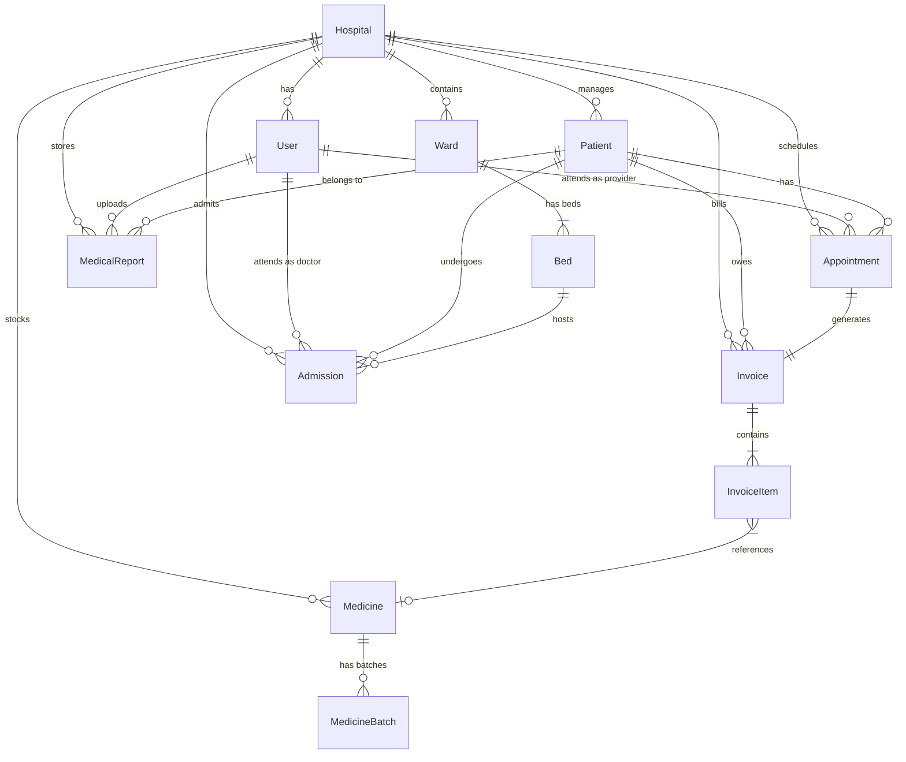

# HealthSync — Project Memory & System Architecture

This document serves as the **Project Memory** and **Source of Truth** for the **HealthSync Hospital Management System (HMS)**. It provides a comprehensive explanation of the multi-tenant architecture, database schema, backend module design, frontend routing, styling guidelines, and engineering conventions. It is designed to act as an instant ramp-up guide for any new AI model or engineer working on this codebase.

---

## 🌟 1. System Vision & Product Summary

**HealthSync** is an enterprise-grade, multi-tenant Hospital Management System (HMS) designed to streamline outpatient department (OPD) services, inpatient department (IPD) ward admissions, pharmacy inventories, billing operations, laboratory report distributions, and general clinical workflows.

### Core Architectural Tenets
1. **Strict Multi-Tenancy**: Data is partitioned and isolated by `hospitalId` foreign keys at the database layer. Cross-tenant data leakages are impossible.
2. **Granular Role-Based Access Control (RBAC)**: Fine-grained permissions dictate what resources each clinical and administrative role can manage or read.
3. **Financial Precision**: All currency operations are calculated and stored in integer cents (e.g., ₹100.00 is represented as `10000`) to avoid floating-point rounding errors.
4. **Clinical Usability**: Instant data summaries, searchable selectors, visual bed boards, and real-time dashboard analytics enable clinical staff to focus on patient care.
5. **Modern Aesthetics**: Rich responsive layouts using a tailored teal/emerald palette, elegant glassmorphism effects, dynamic hover micro-animations, and custom high-performance canvas-based dashboards.

---

## 🏗️ 2. High-Level Technology Stack & Directory Structure

The HealthSync workspace is structured as a monorepo consisting of three main packages:

```
hospital/
├── shared/           # Common TypeScript types shared across boundaries
├── backend/          # NestJS v11 + Prisma ORM + PostgreSQL
└── frontend/         # Next.js v16 (App Router) + TailwindCSS v4
```

### Stack Breakdown

| Layer | Technology | Primary Purpose |
| :--- | :--- | :--- |
| **Frontend Framework** | Next.js 16.1.6 (App Router) | High-performance, server-compatible React application shell |
| **Frontend Styling** | TailwindCSS 4.0.0 | Harmonious CSS variable styling and design tokens |
| **Icons** | Lucide React | Clean, scalable visual indicators |
| **Backend Core** | NestJS 11.0.1 | Modular, structured, enterprise-grade REST API server |
| **Database Access** | Prisma ORM 6.19.2 | Type-safe database queries, schema migrations, and relations |
| **Database Engine** | PostgreSQL 16 | Durable relational data store with robust foreign keys |
| **Authentication** | Passport-JWT + BcryptJS | Secure token validation and stateless role enforcement |
| **File Storage** | AWS S3 SDK v3 | Persistent storage for PDF invoices and uploaded medical reports |
| **PDF Engine** | Puppeteer + Handlebars | Dynamic HTML-to-PDF rendering for official documents |

---

## 📊 3. Database Schema & Data Relationships

The Postgres database structure is managed through the Prisma schema located at `backend/prisma/schema.prisma`. Almost every operational model carries a `hospitalId` to enforce tenant isolation.

### Entity-Relationship Diagram



### Models & Schema Specifications

#### 1. Tenant Definition
*   **`Hospital`**: The root tenant. Every clinical resource, ward, patient, and operational record is tied back to a specific `Hospital` row via a UUID.
    *   Fields: `id`, `name`, `branch`, `address`, `city`, `state`, `zipCode`, `phone`, `managerName`, `isActive`.

#### 2. Auth & Identity
*   **`User`**: Accounts representing hospital employees.
    *   Roles (`Role` Enum): `SUPER_ADMIN`, `ADMIN`, `DOCTOR`, `RECEPTIONIST`, `PHARMACIST`.
    *   Multi-Tenancy: `hospitalId` is **nullable**.
        *   `SUPER_ADMIN` acts as a tenant-less global operator (has `hospitalId = null`).
        *   All other roles *must* be assigned to a `hospitalId`.
    *   Relations: Links to Appointments as provider, Admissions as attending doctor, and Medical Reports as uploader.

#### 3. Core Clinical Core
*   **`Patient`**: Demographics and health indicators.
    *   **Medical Record Number (MRN)**: Unique string generated via standard pattern: `MRN-YYYYMMDD-XXXX` (e.g., `MRN-20260211-A3F2`).
    *   **Soft Deletion**: Implements soft-deleting via the `deletedAt` field. Regular database queries must filter out records where `deletedAt != null`.
    *   Fields: `bloodGroup`, `allergies`, `emergencyContact` (JSON storing `{ name, relationship, phone }`).
*   **`Appointment`**: Schedules linking patients to providers.
    *   Enums (`AppointmentStatus`): `SCHEDULED`, `COMPLETED`, `CANCELLED`, `NO_SHOW`.
    *   Duration stored as minutes (`durationMinutes`, defaults to `30`).

#### 4. Financial Records
*   **`Invoice`**: Patient bills linked 1-to-1 with appointments.
    *   Enums (`PaymentStatus`): `PENDING`, `PAID`, `PARTIALLY_PAID`.
    *   Precision fields (Cents integers): `subtotalCents`, `taxAmountCents`, `discountCents`, `totalCents`.
    *   Rates: `taxRate` stores decimal ratios (e.g., `0.1800` for 18% GST).
    *   Storage keys: `pdfUrl` (public S3 URL) and `s3Key` (internal bucket path).
*   **`InvoiceItem`**: Individual charges.
    *   Enums (`InvoiceItemCategory`): `CONSULTATION`, `LAB_TEST`, `MEDICATION`, `PROCEDURE`, `OTHER`.
    *   Optional relation: `medicineId` link if item represents a dispensed pharmacy stock.

#### 5. Pharmacy & Stock Inventory
*   **`Medicine`**: Product catalog listing medicine metadata.
    *   Fields: `name`, `genericName`, `code` (SKU/Barcode), `category` (Syrup, Tablet, etc.), `manufacturer`, `totalStock` (denormalized sum), `minStock` (reorder threshold), `unitPriceCents`.
    *   Constraint: Unique compound index on `[hospitalId, name]` prevents duplicate medicine naming per hospital.
*   **`MedicineBatch`**: Individual batches tracking cost and expiration.
    *   Fields: `batchNumber`, `expiryDate` (Date-only), `quantity` (current batch count), `costPriceCents`.
    *   This structure enables precise First-Expired, First-Out (FEFO) inventory accounting.

#### 6. Diagnostics & Reports
*   **`MedicalReport`**: PDF results and laboratory outputs.
    *   Enums (`ReportType`): `BLOOD_REPORT`, `ECG`, `ULTRASOUND`, `XRAY`, `OTHER`.
    *   Enums (`ReportDeliveryStatus`): `NOT_SENT`, `SENT`, `FAILED`.
    *   Fields: `fileUrl`, `s3Key`, `aiSummary` (AI summary of report findings), `deliveryError`.

#### 7. Wards & Bed Board (IPD)
*   **`Ward`**: Grouping of physical rooms.
    *   Fields: `name`, `floor`, `type` (e.g., "ICU", "Maternity"), `isActive`.
    *   Constraint: Unique compound index on `[hospitalId, name]`.
*   **`Bed`**: Actual physical spaces.
    *   Enums (`BedStatus`): `AVAILABLE`, `OCCUPIED`, `MAINTENANCE`, `RESERVED`.
    *   Constraint: Unique compound index on `[wardId, bedNumber]`.
*   **`Admission`**: Tracks active inpatient stays.
    *   Enums (`AdmissionStatus`): `ADMITTED`, `DISCHARGED`, `TRANSFERRED`.
    *   Relations: Links a `Patient` and a `Bed` under the care of an `attendingDoctorId` (`User`).

---

## 🔒 4. Security, Auth, & Multi-Tenancy Scoping

Security is implemented at two critical check-points in the backend: Identity verification and Tenant scoping.

### 1. Authentication Strategy
The auth module (`backend/src/auth/`) leverages stateless JWT keys.
*   `JwtStrategy` (extending passport-jwt) extracts Bearer keys from incoming Request headers.
*   The system validates the payload's user ID (`sub`) against the database. If active, it attaches the full `User` object directly to the request (`req.user`).
*   The attached user object carries `role` and `hospitalId`.

### 2. Strict Role-Based Access Control (RBAC)
Role restrictions are declared at the controller route level via a custom `@Roles()` decorator paired with `RolesGuard`:

```typescript
// backend/src/common/guards/roles.guard.ts
@Injectable()
export class RolesGuard implements CanActivate {
    constructor(private reflector: Reflector) {}

    canActivate(context: ExecutionContext): boolean {
        const requiredRoles = this.reflector.getAllAndOverride<Role[]>(ROLES_KEY, [
            context.getHandler(),
            context.getClass(),
        ]);
        if (!requiredRoles || requiredRoles.length === 0) return true;

        const { user } = context.switchToHttp().getRequest();
        
        // SUPER_ADMIN bypasses all local checks
        if (user?.role === 'SUPER_ADMIN') return true;

        return requiredRoles.includes(user?.role);
    }
}
```

#### Role Permission Mapping
*   `SUPER_ADMIN`: Accesses all tenant records globally, manages hospitals, overrides any settings.
*   `ADMIN`: Possesses complete operational control inside their specific `hospitalId` (manages users, wards, inventory, rates).
*   `DOCTOR`: Manages patients, appointments, admissions, diagnoses, and medical reports.
*   `RECEPTIONIST`: Manages patient records, schedules appointments, registers admissions, and drafts invoices.
*   `PHARMACIST`: Oversees medicines, batches, inventory adjustments, and medicine-specific billing items.

### 3. Tenant Propagation Pattern
To prevent cross-tenant exposure, controllers and services must *never* rely on client-supplied `hospitalId` parameters for scoping. They must instead extract it directly from the validated auth request:

```typescript
// Controller scopes request to the validated session
@Post()
@Roles(Role.ADMIN, Role.RECEPTIONIST)
create(@Body() dto: CreatePatientDto, @Request() req: any) {
    return this.patientService.create(dto, req.user.hospitalId);
}

// Service queries are explicitly restricted
async findOne(id: string, hospitalId?: string) {
    const where: any = { id, deletedAt: null };
    if (hospitalId) where.hospitalId = hospitalId; // Applied strictly

    const patient = await this.prisma.patient.findFirst({ where });
    if (!patient) throw new NotFoundException('Patient not found');
    return patient;
}
```

---

## ⚙️ 5. Backend Architecture & Critical Workflows

The NestJS backend is divided into focused feature modules. In addition to basic CRUD operations, it contains two high-impact utilities:

### 1. Compiled Files Output Quirk
The backend's `tsconfig.json` compiles TypeScript with `"module": "nodenext"` and `"baseUrl": "./"`.
*   **Impact**: When Nest builds, it compiles the project into `dist/src/main.js` rather than `dist/main.js` because of the nodenext resolver hierarchy.
*   **Resolution**: Build and startup commands must run from `dist/src/main`. The production start script in `package.json` is set to `node dist/src/main`.

### 2. PDF & Document Generation (`backend/src/pdf/`)
Official documents such as invoices are generated dynamically using Puppeteer:
*   A template service compiles custom Handlebars files with database values.
*   Puppeteer launches in a headless sandbox environment and converts the rendered HTML into a pixel-perfect PDF buffer.
*   The buffer is handed to `UploadService` to be pushed directly to AWS S3.

### 3. AWS S3 Uploads (`backend/src/upload/`)
Integrates securely with Amazon Web Services (`@aws-sdk/client-s3`) to handle files.
*   Pushes invoice PDFs and clinical laboratory reports.
*   Stores files in structured directories: `invoices/{hospitalId}/{invoiceId}.pdf`.
*   Returns cloud URLs (`fileUrl`) to write back into database rows.

---

## 🎨 6. Frontend Architecture & Design Patterns

The frontend application (`frontend/`) is a Next.js 16 App Router interface styled using TailwindCSS v4.

### 1. Directory Structure & Route Groups
```
frontend/src/
├── app/
│   ├── (auth)/         # Group for auth: /login
│   ├── (dashboard)/    # Group for authenticated routes: sidebar + content
│   │   ├── appointments/
│   │   ├── billing/
│   │   ├── dashboard/   # High-level overview & real-time analytics
│   │   ├── patients/
│   │   └── pharmacy/
│   ├── layout.tsx
│   └── page.tsx        # Automatic router redirection based on auth state
├── components/         # Global shared components and UI modal forms
└── lib/                # Contexts, utility formatting, and API client
```

### 2. Typography & Color Variables
The design incorporates custom tokens configured via Tailwind CSS variables:
*   **Colors**: Sleek slate backgrounds (`bg-gray-50/50`) paired with sophisticated teal-emerald clinical accents (`text-teal-600`, `bg-emerald-500`). Avoid using flat primary reds, greens, and blues in favor of tailored modern color variants.
*   **Typography**: Clean sans-serif weights utilizing the modern **Inter** font family.
*   **Borders**: Modern smooth card layouts using premium rounded-2xl radii (`rounded-2xl`).
*   **Micro-interactions**: Interactive components feature smooth transitions (`transition-all duration-300`) and scale on hover (`hover:-translate-y-0.5`).

### 3. High-Performance Canvas Dashboards
To ensure maximum responsive performance and eliminate library-bloat, custom visual components (such as the Appointments by Status radar and line charts) are drawn using standard HTML5 `<canvas>` rendering contexts inside React hooks.

---

## ⚡ 7. API Client & Auth Lifecycle

The frontend communicates with the REST API using a custom client wrapper (`frontend/src/lib/api-client.ts`).

### 1. ApiClient Design
*   Includes built-in support for Bearer tokens.
*   Propagates standard JSON formatting and implements a helper method `multipart` to securely pipe Multipart FormData (e.g. laboratory files) to NestJS.
*   Handles network failures and parses standardized backend exceptions (`ApiError`).

### 2. React Authentication Context (`frontend/src/lib/auth-context.tsx`)
*   Manages authenticated sessions statefully.
*   Saves active JWT tokens (`hms_token`) and user metadata (`hms_user`) inside browser `localStorage`.
*   Propagates logout routines globally across browser windows (`window.location.href = '/login'`).

---

## 🛠️ 8. Developer Commands & Workflows

### Setup & Migrations
Ensure a clean Postgres server is running and configure the required credentials inside `backend/.env`.

```bash
# 1. Install dependencies across projects
npm install

# 2. Run schema migrations
cd backend/
npx prisma migrate dev --name init

# 3. Compile Prisma Client types
npm run prisma:generate
```

### Running Locally
To launch both environments concurrently during active development:

```bash
# Backend (Port 3001)
cd backend/
npm run start:dev

# Frontend (Port 3000)
cd frontend/
npm run dev
```

### Database Seeding & Maintenance
The repository comes equipped with utility scripts to initialize or clear records quickly:

```bash
# Seed the initial SUPER_ADMIN account
# Default Credentials: admin@hospital.com / Admin@123
npm run seed:super-admin

# Clear development database completely (retains SUPER_ADMIN)
npx ts-node --compiler-options '{"module":"commonjs"}' prisma/reset-data.ts
```

### Build & Deploy
For production server deployments:

```bash
# Backend build pipeline
cd backend/
npm run build
npm run deploy:start

# Frontend build pipeline
cd frontend/
npm run build
npm run start
```
